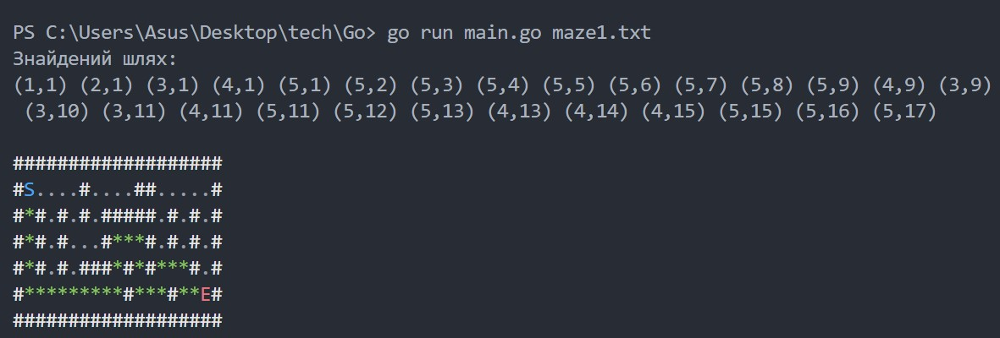
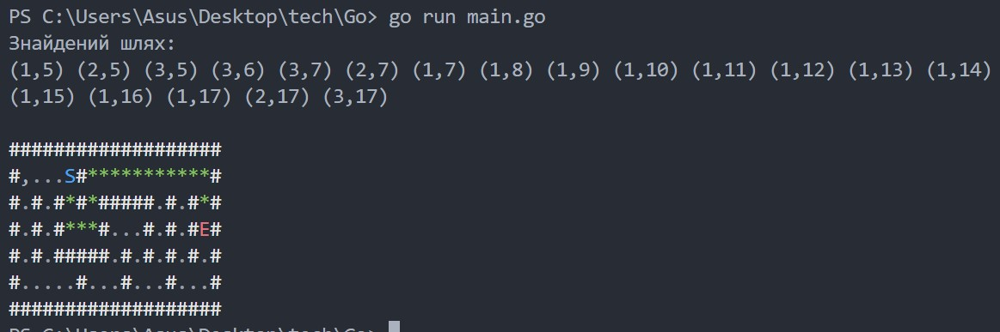

# Maze Solver

**Maze Solver** — це консольна програма на Go, яка знаходить найкоротший шлях у лабіринті від точки **S** до точки **E**.

---

## Механіка роботи

- Програма приймає **файл з лабіринтом** або використовує **вбудований лабіринт за замовчуванням**.
- **Символи лабіринту:**
  - `S` — початок шляху
  - `E` — кінець шляху
  - `.` — прохід
  - `#` — стіна
- Після обчислення шлях відображається в терміналі:
  - Початок — синім
  - Кінець — червоним
  - Шлях — зеленим
- Використовується алгоритм **BFS (пошук у ширину)** для знаходження найкоротшого шляху.

---

## Технології

- **Go (Golang)**
- **Консольний кольоровий вивід (ANSI escape codes)**

---

## Запуск

```bash
# Запуск з файлом лабіринту
go run main.go maze.txt

# Або використати лабіринт за замовчуванням
go run main.go
```

---






