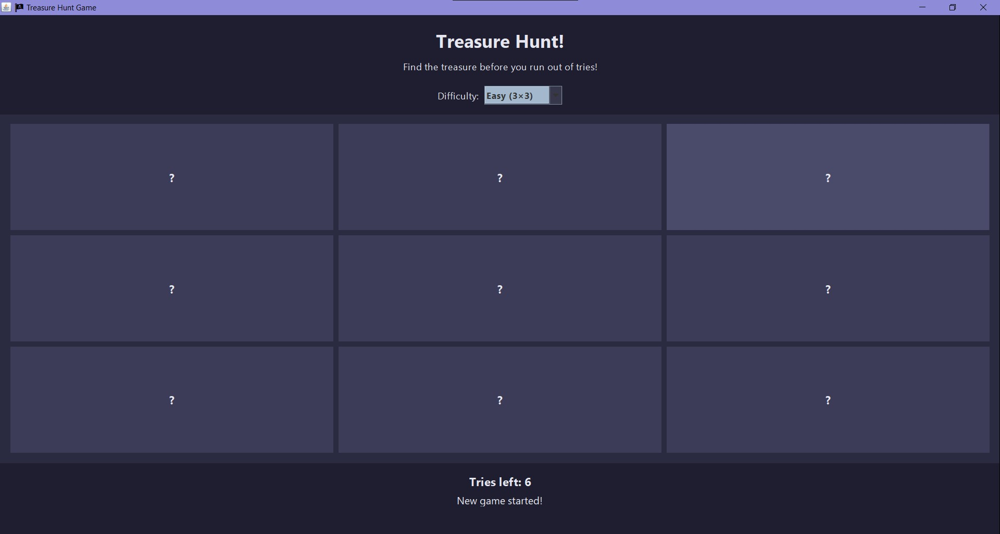
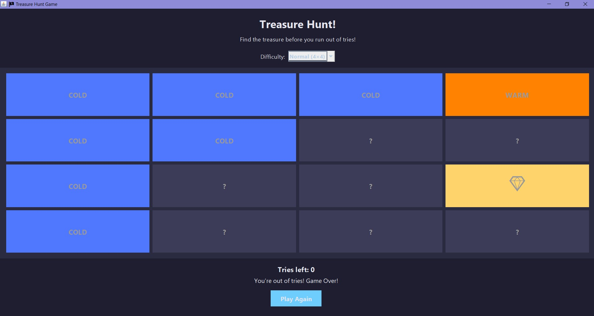
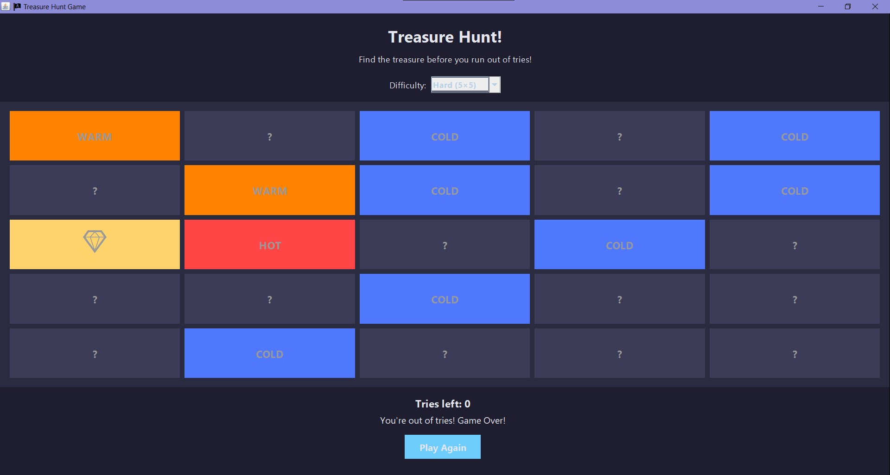

# 🏴‍☠️ Treasure Hunt Game (Java Swing)

**A simple graphical "Find the Treasure" game built using Java Swing.**

---

## 🎯 Objective

Find the hidden **treasure (💎)** on the grid before you run out of tries.

The game is played on a square grid, and the number of attempts is determined by the difficulty level (Grid Size × 2).

---

## 🕹 Features

- **GUI Interface:** Developed using the **Java Swing** framework.
- **Dynamic Difficulty:** Players can select the grid size (and thus the number of tries) before starting a new game:
  - **Easy (3×3 Grid)**: 6 Tries
  - **Normal (4×4 Grid)**: 8 Tries
  - **Hard (5×5 Grid)**: 10 Tries
- **Hint System (Hot/Cold):** After an incorrect guess, the clicked cell reveals a hint based on its **Manhattan distance** from the treasure:
  - `HOT`: Distance = 1 step
  - `WARM`: Distance ≤ 2 steps
  - `COOL`: Getting closer
  - `COLD`: Far away
- **Replayability:** Includes a "Play Again" button and an accessible difficulty selector.

---

## 💻 Technical Details

The project is a single Java class file utilizing standard Java libraries.

| Feature         | Implementation                                                                                                         |
| :-------------- | :--------------------------------------------------------------------------------------------------------------------- |
| **GUI**         | `javax.swing.JFrame`, `JPanel`, `JButton`, `JLabel`, `JComboBox`                                                       |
| **Layout**      | `BorderLayout` (main frame) and `GridLayout` (game grid)                                                               |
| **Logic**       | The treasure location (`treasureRow`, `treasureCol`) is chosen randomly using `java.util.Random`.                      |
| **Game State**  | Uses instance variables (`tries`, `gridSize`) and UI components (`triesLabel`, `statusLabel`) to manage the game flow. |
| **Interaction** | Uses `ActionListener` and `MouseListener` for button clicks and hover effects.                                         |

---

## 🎨 Color Palette (Defined in Code)

The code defines a professional, high-contrast palette:

| Name              | Hex Equivalent | Description                  |
| :---------------- | :------------- | :--------------------------- |
| `DARK_BACKGROUND` | `#1E1E2F`      | Main window background       |
| `GRID_BACKGROUND` | `#2A2A40`      | Area behind the buttons      |
| `ACCENT_COLOR`    | `#6ECDFD`      | Blue for emphasis/buttons    |
| `WIN_COLOR`       | `mint green`   | Indicates a win              |
| `REVEAL_COLOR`    | `warm gold`    | Reveals the treasure on loss |

---

## ⚙️ Running the Project

1.  **Save the file:** Save the provided Java code as `TreasureHunt.java`.
2.  **Compile:** Compile the file using the Java Development Kit (JDK):
    ```bash
    javac TreasureHunt.java
    ```
3.  **Run:** Execute the compiled class file:
    ```bash
    java TreasureHunt
    ```
    The game window should appear, allowing you to select a difficulty and start playing.

---






