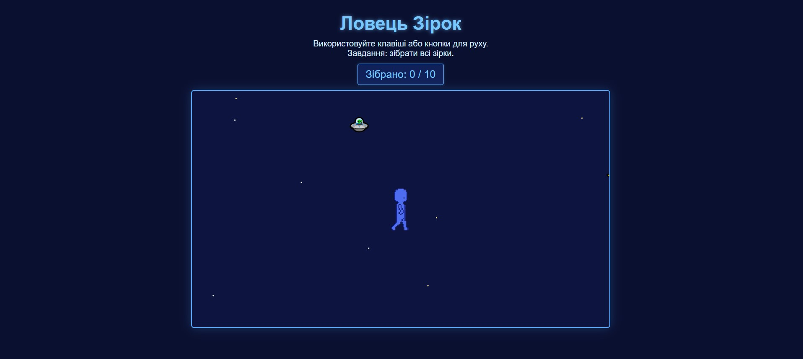
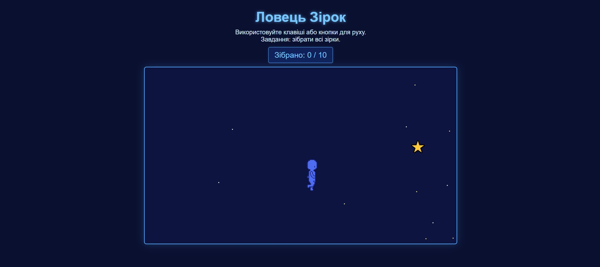
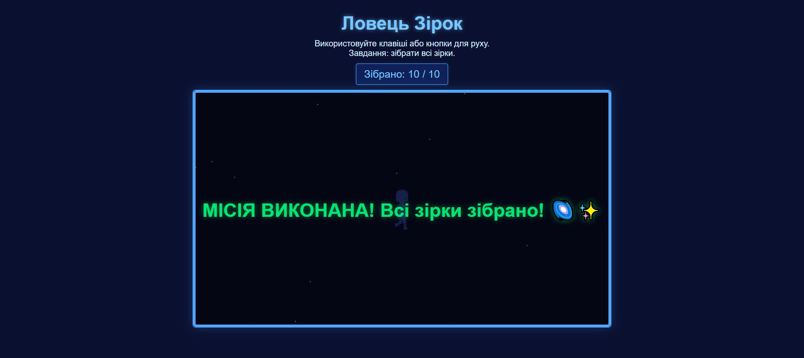

# Ловець Зірок

**Ловець Зірок** — це міні-гра, де гравець керує персонажем, збирає зірки ⭐ та уникає прибульців 🛸.  
Гра працює в браузері та має підтримку управління на телефонах.

[Demo](https://helenhapp.github.io/js/star-catcher.html)

---

## Механіка гри

- Рух персонажа:
  - На компʼютері — стрілками клавіатури.
  - На телефоні — через екранні кнопки.
- Мета — **зібрати всі зірки**.
- Якщо персонажа торкнеться прибулець — поразка.
- Камера слідує за персонажем у великому світі (2500×1800 px).
- Є анімація ходьби, фонові зірки, зіткнення, ефекти завершення гри.

---

## Технології

- **HTML5**
- **CSS3**
- **JavaScript**

---

