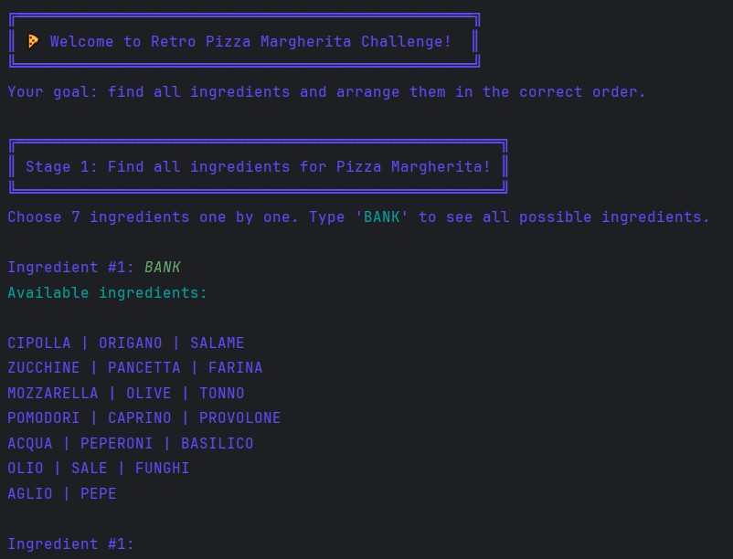
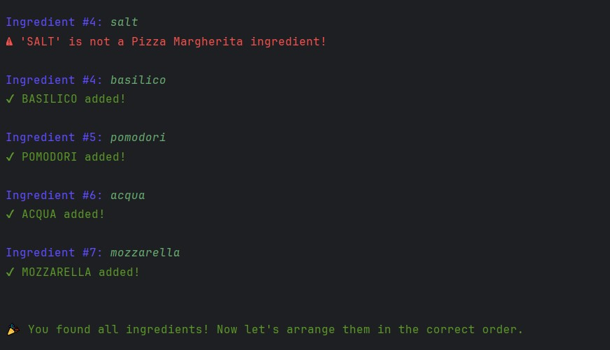
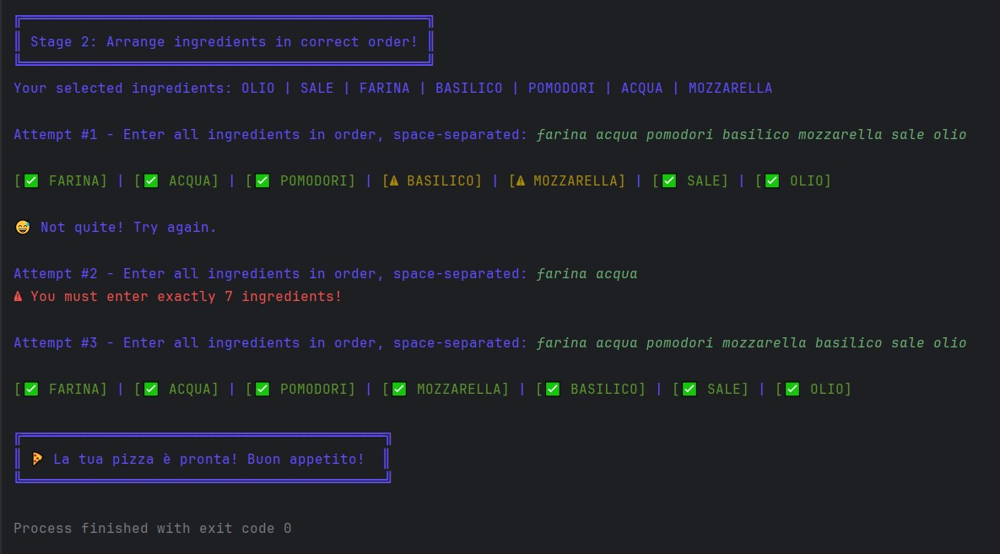

# 🍕 Pizza Margherita Challenge

**A Kotlin console game where you find and arrange ingredients to make a perfect Pizza Margherita.**

---

## Features

- Interactive **two-stage game**:
  1. **Find all ingredients** for Pizza Margherita
  2. **Arrange ingredients** in the correct order
- **ANSI-colored console output** for feedback:
  - ✅ Green: correct ingredient / correct position
  - ⚠ Yellow: correct ingredient / wrong position
  - ❌ Red: wrong ingredient
- **Ingredient bank** display for hints
- **Limited attempts** for arranging ingredients
- Retro-styled text boxes for messages

---

## How to Play

1. **Stage 1 – Find Ingredients**

   - Enter ingredient names one by one.
   - Type `BANK` to view all available ingredients.
   - Correct ingredients are added to your selection.
   - You cannot select duplicates or incorrect ingredients.

2. **Stage 2 – Arrange Ingredients**
   - Arrange your selected ingredients in the **correct order** for Margherita pizza.
   - You have a limited number of attempts.
   - Colored feedback guides you:
     - Green `[✅]` – correct ingredient at correct position
     - Yellow `[⚠]` – correct ingredient, wrong position
     - Red `[❌]` – incorrect ingredient
   - Success ends the game with a congratulatory message.

---

