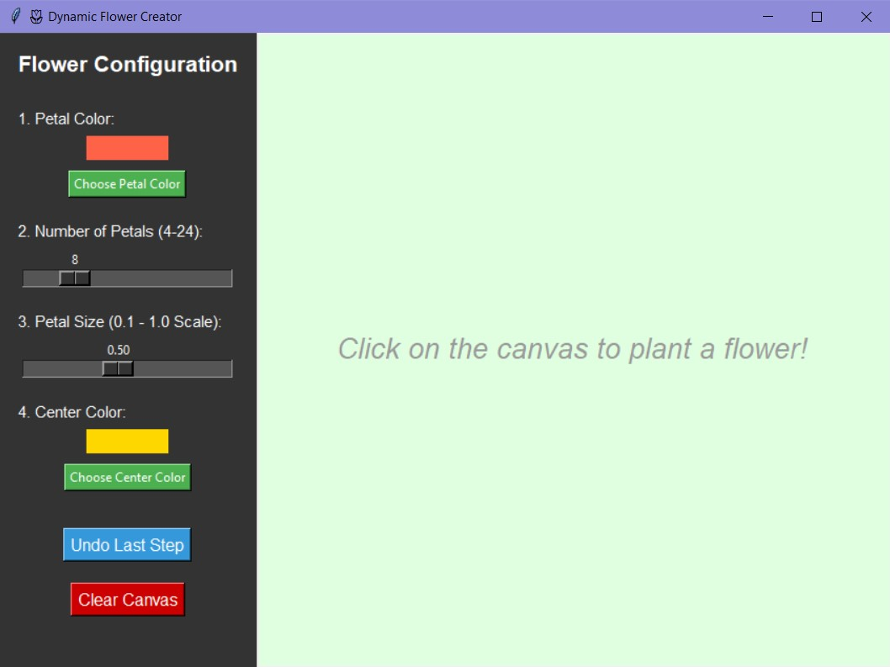
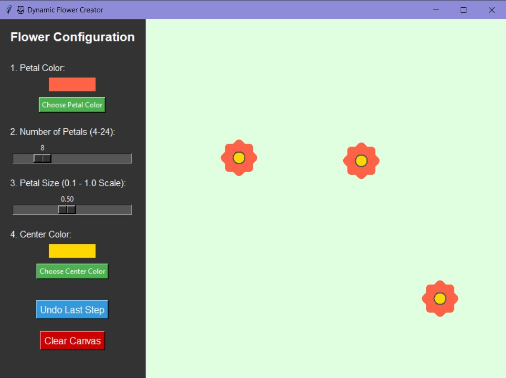
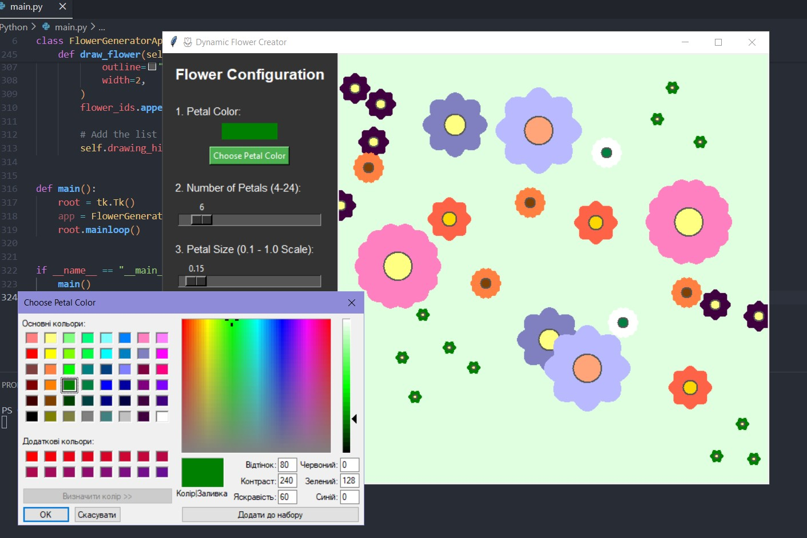
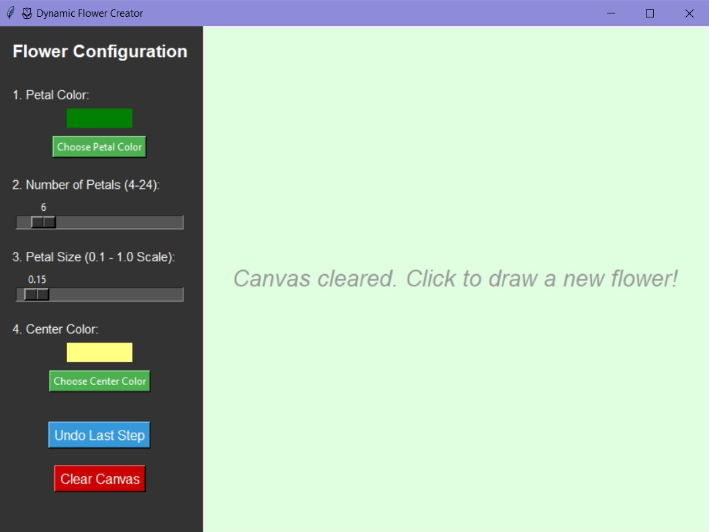

# 🌷 Dynamic Flower Creator

**A Python Tkinter app that lets you configure and draw custom flowers on a canvas.**

---

## Features

- Draw flowers with **clicks on the canvas**
- Customize **petal color** and **center color**
- Adjust **number of petals** (4–24)
- Adjust **petal size** (0.1–1.0 scale)
- **Undo** the last flower
- **Clear canvas** to start fresh
- **Multiple flowers** can be drawn and stored
- Smooth, visually appealing petals using polygons and curves

---

## How It Works

1. **Configure your flower** using the controls on the left:
   - Petal color
   - Number of petals
   - Petal size
   - Center color
2. **Click on the canvas** to draw the flower at that location
3. Use **Undo** to remove the last flower or **Clear Canvas** to remove all flowers
4. All flowers are stored in a **drawing history** so multiple flowers can coexist

---

## Example Usage

```python
import tkinter as tk
from flower_generator import FlowerGeneratorApp

root = tk.Tk()
app = FlowerGeneratorApp(root)
root.mainloop()
```

- Click anywhere on the canvas to plant a flower
- Use sliders and color pickers to customize

---

## Controls

- Petal Color – choose from a color picker
- Number of Petals – slider from 4 to 24
- Petal Size – scale from 0.1 to 1.0
- Center Color – choose color for the flower center
- Undo Last Step – remove the most recent flower
- Clear Canvas – remove all flowers

---

## Dependencies

- Python 3.x
- Tkinter (built-in standard library)
- math (standard library)

---








