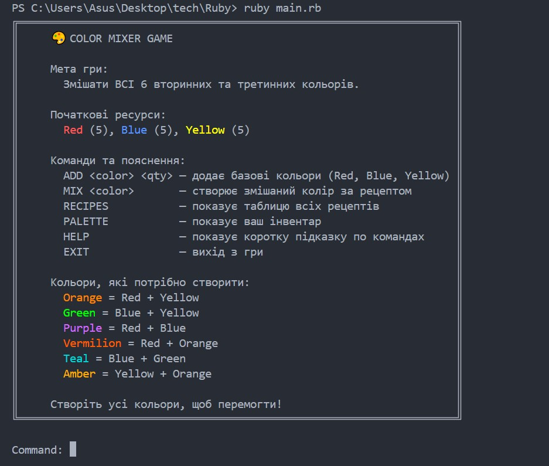
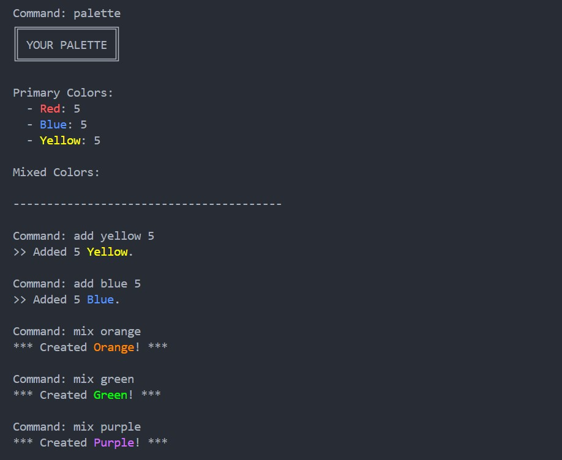
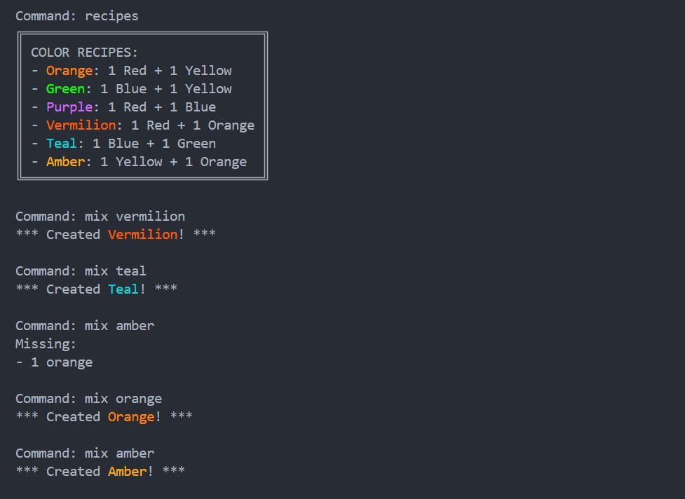
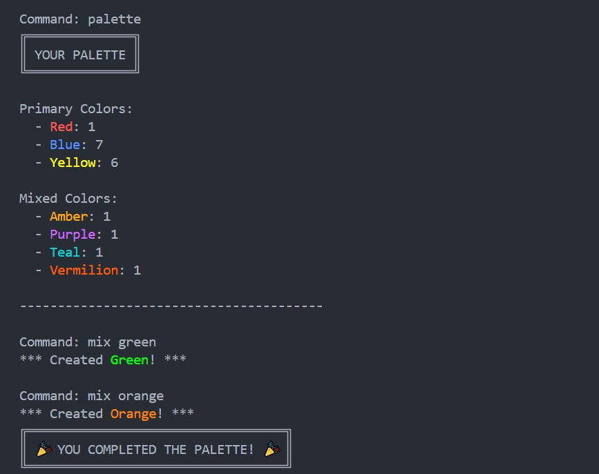

# 🎨 ASCII Color Mixer Game 

**A console-based game in Ruby where you mix primary colors to create secondary and tertiary colors using ASCII boxes and ANSI colors.**

---

## 🎯 Objective

Mix **all 6 secondary and tertiary colors**:

- **Secondary Colors**: Orange, Green, Purple
- **Tertiary Colors**: Vermilion, Teal, Amber

You start with basic primary colors (Red, Blue, Yellow) and recipes to combine them. The goal is to complete your palette.

---

## 🛠 Features

- Retro **ASCII boxes** for messages
- Emoji- and CJK-safe text handling
- **ANSI color** output for each color
- Interactive commands:
  - `ADD <color> <qty>` – add primary colors to your inventory
  - `MIX <color>` – create a new color using available ingredients
  - `RECIPES` – show all color recipes
  - `PALETTE` – view your current inventory
  - `HELP` – show a quick command guide
  - `EXIT` – quit the game
- Tracks inventory of all colors
- Victory detection when all target colors are created

---

## 🎨 Color Recipes

| Result        | Recipe          | Type      |
| ------------- | --------------- | --------- |
| **Orange**    | Red + Yellow    | Secondary |
| **Green**     | Blue + Yellow   | Secondary |
| **Purple**    | Red + Blue      | Secondary |
| **Vermilion** | Red + Orange    | Tertiary  |
| **Teal**      | Blue + Green    | Tertiary  |
| **Amber**     | Yellow + Orange | Tertiary  |

---

## 🕹 How to Play

1.  Start the game.
2.  Use `ADD` to top up primary colors if needed:
    ```text
    ADD Red 2
    ```
3.  Use `MIX` to create new colors:
    ```text
    MIX Orange
    ```
4.  Check your current palette at any time with **PALETTE**.
5.  View all recipes with **RECIPES**.
6.  Continue mixing until you have created all secondary and tertiary colors.
7.  Game ends with a victory message when your palette is complete.

---

## 📦 Inventory System

Tracks quantities of all colors.

Primary colors are automatically provided at the start:

- **Red**: 5
- **Blue**: 5
- **Yellow**: 5

Mixed colors increase in quantity as you craft them. Inventory is **color-coded** for easy recognition in the console.

---

## 💻 Running the Game

1.  Save the code as `color_mixer.rb`.
2.  Run using Ruby:
    ```bash
    ruby color_mixer.rb
    ```
3.  Follow on-screen instructions to mix colors and complete your palette.

---

## 📌 Notes

- Works best in a terminal that supports **ANSI 256 colors**.
- Handles emoji and wide characters in messages correctly.
- Retro ASCII boxes adapt to text width dynamically.

---

## 🎉 Victory

When all secondary and tertiary colors are crafted, you will see:

```text
🎉 YOU COMPLETED THE PALETTE! 🎉
```

---








