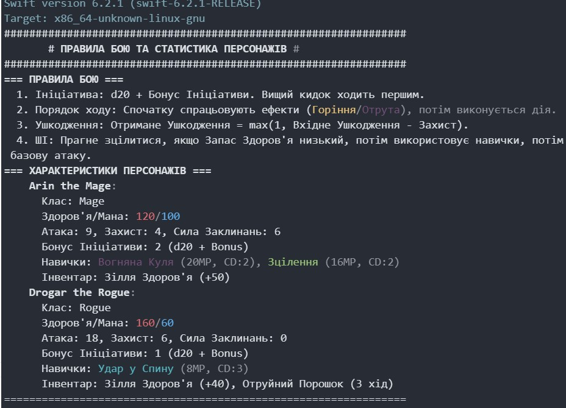
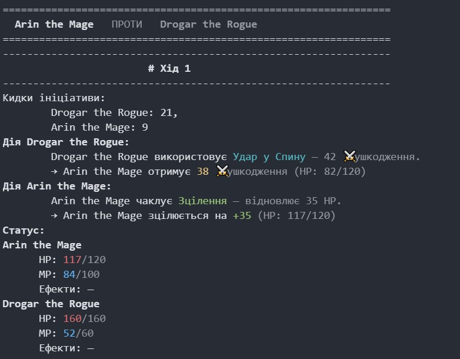
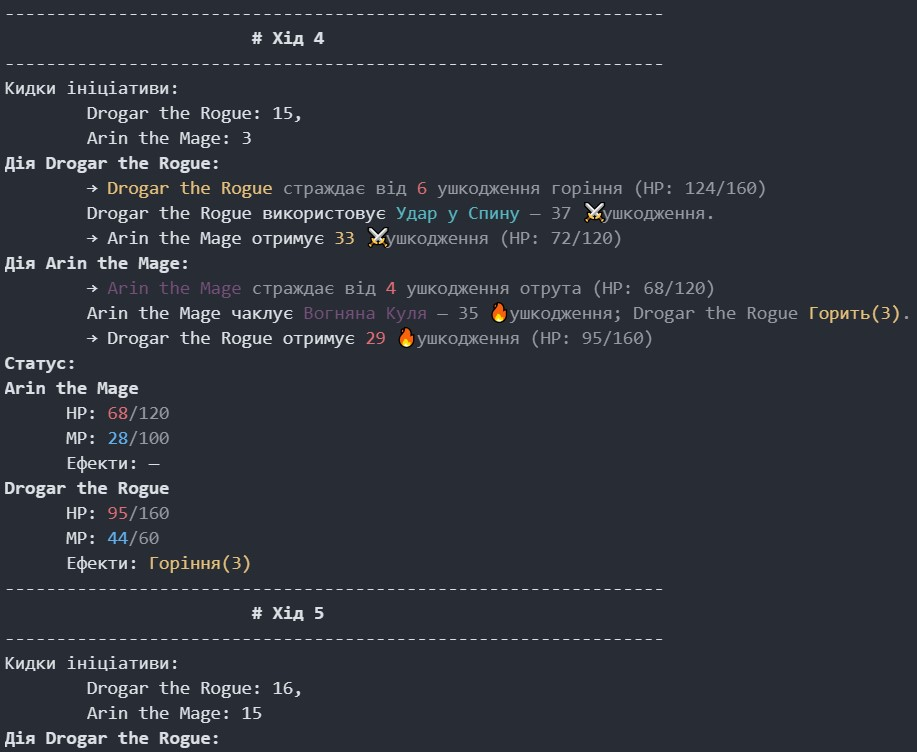
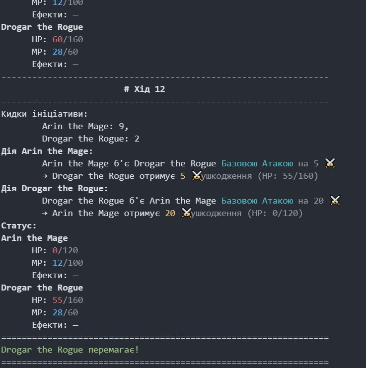

# ASCII RPG Combat Simulator

**Simple turn-based battle simulator in Swift** with ASCII logs, status effects, skills, and items.

---

## Features

- **Turn-based combat** with initiative (d20 + bonus)
- **Classes**: Mage, Rogue, Warrior (you can extend)
- **Skills** with mana cost and cooldown:
  - Mage: `Fireball`, `Heal`
  - Rogue: `Backstab`
- **Inventory items**:
  - Healing potions
  - Mana potions
  - Poison dust
- **Status effects**:
  - Burning 🔥
  - Poisoned ☠️
- **Simple AI** for enemy actions
- **Colorful ASCII combat log** using ANSI colors

---

## How It Works

1. Each character rolls initiative (`d20 + bonus`) to determine order.
2. On their turn:
   - Effects like **Burning** and **Poison** are applied.
   - AI chooses action: heal, use skill, use item, or basic attack.
3. Combat continues until one character is defeated or max turns reached.
4. Logs show HP/MP, effects, and action details.

---

## Character Example

```swift
var arin = Character(name: "Arin the Mage (Арін Маг)", hp: 120, mana: 100, attack: 9, defense: 4, spellPower: 6, initiativeBonus: 2)
arin.skills = [Fireball(), Heal()]
arin.items = [.potionHP(amount: 50)]

var drogar = Character(name: "Drogar the Rogue (Дрогар Розбійник)", hp: 160, mana: 60, attack: 18, defense: 6, spellPower: 0, initiativeBonus: 1)
drogar.skills = [Backstab()]
drogar.items = [.potionHP(amount: 40), .poisonDust(turns: 3)]
```

## Run Combat

```swift
startCombat(&arin, &drogar)
```

## Shows turn-by-turn ASCII log

- Displays status, effects, damage dealt, and skills used
- Ends with winner or draw

---








